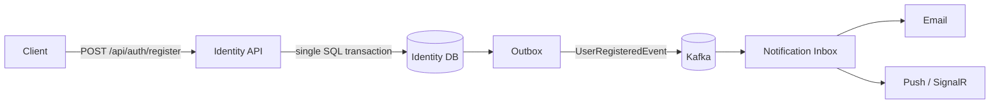

# Identity Service

A .NET 10 authentication microservice built with ASP.NET Core Identity, OpenIddict, EF Core, SQL Server, Kafka, and OpenTelemetry.

> This is a local/demo implementation. Checked-in development credentials belong only to the disposable companion Infrastructure stack. Never reuse them in a shared or production environment.

## Responsibilities

- Register users and persist identities in the service-owned `IAM` database.
- Issue OAuth 2.0 access and refresh tokens through OpenIddict.
- Invalidate refresh tokens after security-stamp changes or user lockout.
- Persist `UserRegisteredEvent` records in a transactional outbox and publish them to Kafka.
- Export HTTP, EF Core, and Kafka producer traces through OTLP.

The service does not access Notification data and does not call Notification synchronously.

## Architecture and main scenario



Registration commits the user and outbox record atomically. `OutboxDispatcher` later publishes the event with W3C trace headers. The Notification consumers independently claim it through their inbox handlers.

## Local dependencies

The service requires SQL Server, Kafka, Redis, an SMTP server, and an OTLP-compatible tracing backend. These dependencies are provided separately. For Docker Compose setup, ports, credentials, and startup instructions, refer to the **Infrastructure repository**.

## Configuration and credentials

Development settings are in `src/idnetityServiceWedApi/appsettings.Development.json`. Important keys are:

- `ConnectionStrings:AuthDb`
- `Kafka:BootstrapServers`
- `Kafka:Topics:UserRegisteredEvents`
- `Outbox:PollingIntervalSeconds`
- `OpenTelemetry:OtlpEndpoint`
- `RateLimiting:Enabled`

The checked-in SQL password is a sample credential for the local Docker stack only. No real production password, token, API key, or certificate should be committed. Override sensitive values with environment variables or a secret store.

Rate limiting is disabled in Development so k6 can exercise the API. The password grant is retained for this demo/load-test workflow; an interactive production client should use Authorization Code with PKCE.

## Run

From the repository root:

```powershell
dotnet restore IdentityService.slnx
dotnet run --project src/idnetityServiceWedApi/idnetityServiceWedApi.csproj
```

Pending EF Core migrations are applied on startup for this local/demo setup. In Development, Scalar is available at `/scalar/v1` and OpenAPI at `/openapi/v1.json` on the address printed by `dotnet run`.

## Tests

Docker Desktop must be running because integration tests use a real SQL Server through Testcontainers.

```powershell
dotnet test IdentityService.slnx
```

The suite covers refresh-token invalidation after a security-stamp change, locked-out users, and the Development rate-limit override. Assertions use Shouldly.

## Observability

With the Infrastructure stack running, open Jaeger at <http://localhost:16696> and select `IdentityService`. A registration trace continues through the outbox publisher and Notification consumers.
